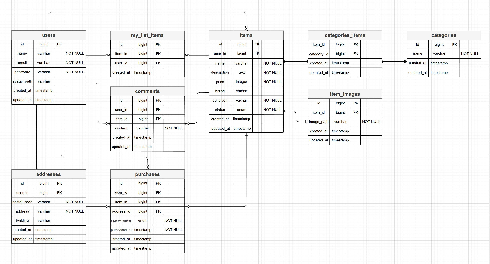
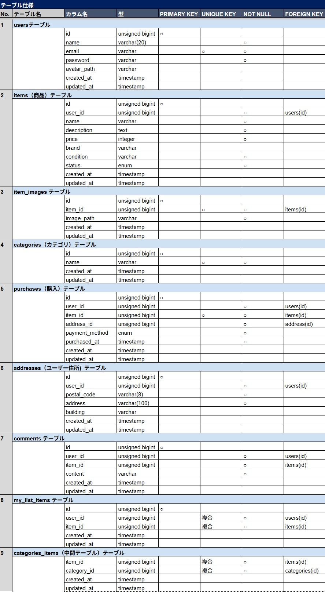

# freemarket.app "補完版" README

# ◎ coachtechフリマ

本アプリは、coachtech が提示する仕様書をもとに作成したフリマアプリです。
ユーザー登録、ログイン、商品一覧、商品詳細、出品、購入、プロフィール編集など、
フリマアプリとして必要な基本機能を実装しています。

# ◎ 🐳 開発環境構築

## ◆ リポジトリのクローン

```bash
git clone git@github.com:nasu-masa/freemarket-app.git
cd freemarket-app
```

## ◆ Docker ビルド & 起動

```bash
docker-compose up -d --build
```

## ◆ Laravel セットアップ

```bash
docker-compose exec php bash

composer install

code .

cp .env.example .env  ※環境変数適宣変更

php artisan key:generate

php artisan migrate
php artisan db:seed

php artisan storage:link
```

## ◆テスト環境のセットアップ

1. テスト用 `.env.testing` ファイルの作成とアプリキーの生成

```bash
cp .env .env.testing
php artisan key:generate --env=testing
```

DB 接続情報（DB_HOST / DB_DATABASE / DB_USERNAME / DB_PASSWORD）は、各自のローカル環境に合わせて変更してください。
Stripe / AWS / Pusher などの秘密情報は空欄のままで問題ありません。

2. テスト用データベースの作成（重要）
   Laravel のテストは .env.testing の設定を使用します。
   .env.testing に記載されている DB 名（例：demo_test）のデータベースを 事前に作成する必要があります。

Docker を使用している場合：

```bash
docker exec -it <mysqlコンテナ名> bash
mysql -u root -p
CREATE DATABASE demo_test;
SHOW DATABASES;
```

※ <mysqlコンテナ名> は docker ps で確認できます。

ローカル MySQL を使う場合：

```bash
mysql -u root -p
CREATE DATABASE demo_test;
SHOW DATABASES;
```

3. テスト用マイグレーションの実行
   テスト DB を作成したら、テーブルを作成します。

```bash
php artisan migrate:fresh --env=testing
```

4. テストの実行
```bash
php artisan test --env=testing
```

````

DB 接続情報などは 各自のローカル環境に合わせて変更してください。
Stripe / AWS / Pusher などの秘密情報は 空欄のままで OK。

##　◆Stripe のセットアップ

※本アプリでは、商品購入時の決済に **Stripe** を使用しています。

### ◆ インストール

```bash
composer require stripe/stripe-php
```

````
### ◆ Stripe の環境変数（.env）

```bash
STRIPE_KEY = your_stripe_public_key;
STRIPE_SECRET = your_stripe_secret_key;
```

## ◆ 開発環境 URL

| 機能                  | URL                       |
| --------------------- | ------------------------- |
| トップページ          | http://localhost/         |
| ユーザー登録          | http://localhost/register |
| phpMyAdmin            | http://localhost:8080/    |
| MailHog（メール確認） | http://localhost:8025/    |

# ◎ 🗂 テーブル仕様書 & ER図

本アプリケーションは、coachtech が提示する仕様書（US001〜US009）に基づき
データベース設計を行っています。

以下に **ER図** と **テーブル仕様書** を掲載します。

---

## ◆ ER図（Entity Relationship Diagram）



ER図では以下のエンティティを定義しています：

- users
- items
- item_images
- categories
- category_item（中間テーブル）
- comments
- purchases
- addresses
- my_list_items

---

## ◆ テーブル仕様書



テーブル仕様書では以下の内容を定義しています：

- カラム名
- データ型
- NULL 許可
- デフォルト値
- 外部キー制約
- カーディナリティ（1対多、多対多 など）

本アプリのマイグレーションファイルは、

このテーブル仕様書と完全に一致するように実装しています。

# ◎ 🧩 使用技術（実行環境）

- **PHP 8.x**
- **Laravel 8**
- **MySQL 8.0.32**
- **nginx 1.21.1**
- **Docker / Docker Compose**
- **CSS**
- **Laravel Fortify（認証）**

> ※ 各サービスの構成は `docker-compose.yml` を参照してください

# ◆ 📁 ディレクトリ構造（主要部分のみ）

```jsx
src/
├── app/
│   ├── Actions/                # Fortify関連アクション
│   ├── Http/
│   │   ├── Controllers/        # 各種コントローラー
│   │   ├── Middleware/
│   │   └── Requests/           # バリデーション
│   ├── Models/                 # モデル
│   ├── Notifications/          # メール通知
│   ├── Policies/
│   ├── Providers/              # FortifyServiceProvider など
│   └── Services/               # ビジネスロジック
│
├── config/                     # fortify.php / category.php など
│
├── database/
│   ├── migrations/             # テーブル定義
│   ├── seeders/                # 初期データ
│   └── factories/              # テスト用データ
│
├── public/
│   ├── assets/
│   ├── css/
│   ├── js/
│   └── products/               # 商品画像
│
├── resources/
│   └── views/
│       ├── layouts/
│       ├── auth/
│       ├── items/
│       ├── mypage/
│       ├── purchase/
│       └── emails/
│
├── routes/
│   └── web.php
│
└── tests/
    └── Feature/                # 機能テスト
```

## ◆ ルート 一覧 (Route)

---

■ 画面名称：商品一覧画面（トップ画面）

- パス：/
- メソッド：GET
- コントローラー：ItemController
- アクション：index
- 認証必須：不要
- 説明：商品一覧ページ

---

■ 画面名称：商品一覧画面（トップ画面）\_マイリスト

- パス：/?tab=mylist
- メソッド：GET
- コントローラー：ItemController
- アクション：index
- 認証必須：必須
- 説明：マイリストタブ表示

---

■ 画面名称：会員登録画面

- パス：/register
- メソッド：GET
- コントローラー：RegisterController
- アクション：show
- 認証必須：不要
- 説明：新規登録フォーム

---

■ 画面名称：会員登録処理

- パス：/register
- メソッド：POST
- コントローラー：RegisterController
- アクション：register
- 認証必須：不要
- 説明：新規登録画面表示のみ（処理は Fortify）

---

■ 画面名称：ログイン画面

- パス：/login
- メソッド：GET
- コントローラー：LoginController
- アクション：show
- 認証必須：不要
- 説明：ログインフォーム

---

■ 画面名称：ログイン処理

- パス：/login
- メソッド：POST
- コントローラー：LoginController
- アクション：login
- 認証必須：不要
- 説明：ログイン画面遷移のみ（処理は Fortify）

---

■ 画面名称：ログアウト

- パス：/logout
- メソッド：POST
- コントローラー：LoginController
- アクション：logout
- 認証必須：必須
- 説明：ログアウト処理（Fortify）

---

■ 画面名称：商品詳細画面

- パス：/item/{item_id}
- メソッド：GET
- コントローラー：ItemController
- アクション：show
- 認証必須：不要
- 説明：商品詳細

---

■ 画面名称：商品詳細画面\_いいね追加

- パス：/item/{item_id}/like
- メソッド：POST
- コントローラー：MyListItemController
- アクション：store
- 認証必須：必須
- 説明：マイリスト(いいね)追加処理

---

■ 画面名称：商品詳細画面\_コメント投稿

- パス：/item/{item_id}/comments
- メソッド：POST
- コントローラー：CommentController
- アクション：store
- 認証必須：必須
- 説明：コメント送信処理

---

■ 画面名称：商品購入画面

- パス：/purchase/{item_id}
- メソッド：GET
- コントローラー：PurchaseController
- アクション：create
- 認証必須：必須
- 説明：購入確認画面

---

■ 画面名称：商品購入処理

- パス：/purchase/{item_id}
- メソッド：POST
- コントローラー：PurchaseController
- アクション：store
- 認証必須：必須
- 説明：購入処理

---

■ 画面名称：住所変更ページ

- パス：/purchase/address/{item_id}
- メソッド：GET
- コントローラー：AddressController
- アクション：editAddress
- 認証必須：必須
- 説明：購入時の住所変更

---

■ 画面名称：住所変更処理

- パス：/purchase/address/{item_id}
- メソッド：POST
- コントローラー：AddressController
- アクション：storeAddress
- 認証必須：必須
- 説明：購入時の住所変更処理

---

■ 画面名称：商品出品画面

- パス：/sell
- メソッド：GET
- コントローラー：ItemController
- アクション：create
- 認証必須：必須
- 説明：出品フォーム

---

■ 画面名称：商品出品処理

- パス：/sell
- メソッド：POST
- コントローラー：ItemController
- アクション：store
- 認証必須：必須
- 説明：出品処理

---

■ 画面名称：プロフィール画面

- パス：/mypage
- メソッド：GET
- コントローラー：ProfileController
- アクション：index
- 認証必須：必須
- 説明：マイページ

---

■ 画面名称：プロフィール編集画面

- パス：/mypage/profile
- メソッド：GET
- コントローラー：ProfileController
- アクション：edit
- 認証必須：必須
- 説明：プロフィール編集

---

■ 画面名称：プロフィール更新処理

- パス：/mypage/profile
- メソッド：POST
- コントローラー：ProfileController
- アクション：store
- 認証必須：必須
- 説明：プロフィール更新

---

■ 画面名称：プロフィール画面\_購入した商品一覧

- パス：/mypage?page=buy
- メソッド：GET
- コントローラー：ProfileController
- アクション：index
- 認証必須：必須
- 説明：購入履歴タブ

---

■ 画面名称：プロフィール画面\_出品した商品一覧

- パス：/mypage?page=sell
- メソッド：GET
- コントローラー：ProfileController
- アクション：index
- 認証必須：必須
- 説明：出品履歴タブ

---

## ◆　コントローラー 一覧（Controller）

| コントローラーファイル名 | 説明                                                         |
| ------------------------ | ------------------------------------------------------------ |
| ItemController.php       | 商品一覧・詳細・出品フォーム・出品処理を管理                 |
| MyListItemController.php | マイリスト（お気に入り）追加を管理                           |
| CommentController.php    | 商品へのコメント投稿を管理                                   |
| PurchaseController.php   | 購入確認画面・購入処理を管理                                 |
| AddressController.php    | 購入時の住所変更画面・住所更新処理を管理                     |
| ProfileController.php    | マイページ、購入履歴・出品履歴、プロフィール編集・更新を管理 |
| RegisterController.php   | 会員登録フォーム表示（処理は Fortify が担当）                |
| LoginController.php      | ログインフォーム表示（処理は Fortify が担当）                |

## ◆ モデル 一覧（Model）

| モデルファイル名 | 説明                                                                                 |
| ---------------- | ------------------------------------------------------------------------------------ |
| User.php         | ユーザー情報を管理                                                                   |
| Address.php      | ユーザーの住所情報（郵便番号・都道府県・市区町村・番地・建物名）を管理               |
| Category.php     | 商品カテゴリを管理                                                                   |
| Comment.php      | 商品へのコメントを管理                                                               |
| Item.php         | 出品された商品データ（タイトル・説明・価格・カテゴリ・ブランド・状態・出品者）を管理 |
| ItemImage.php    | 商品画像を管理                                                                       |
| MyListItem.php   | ユーザーのお気に入り（マイリスト）を管理                                             |
| Purchase.php     | 購入情報（購入者・商品・購入日時・金額）を管理                                       |

## ◆ ビュー 一覧（Bladeファイル）

| 画面名称                         | Bladeファイル名                 |
| -------------------------------- | ------------------------------- |
| 商品一覧画面（トップ画面）       | items/index.blade.php           |
| 会員登録画面                     | auth/register.blade.php         |
| ログイン画面                     | auth/login.blade.php            |
| 商品詳細画面                     | items/show.blade.php            |
| 商品購入画面                     | purchase/create.blade.php       |
| 送付先住所変更画面               | purchase/address_edit.blade.php |
| 商品出品画面                     | items/create.blade.php          |
| プロフィール画面                 | mypage/index.blade.php          |
| プロフィール編集画面（設定画面） | mypage/profile_edit.blade.php   |
| メール認証誘導画面               | auth/verify_email.blade.php     |

## ◆ フロントエンド構成（CSS / JS）

CSS・JavaScript は以下のようにページ単位と共通コンポーネントに分割されています。
詳細は `public/css/` および `public/js/` ディレクトリを参照してください。

# ◎ 🧩 主な機能一覧（仕様書 US001〜US009 に準拠）

## ◆ 認証（US001〜US003）

- 会員登録（メール認証あり）
- ログイン / ログアウト
- 初回プロフィール設定
- 認証メール再送
- 未認証ユーザーのアクセス制御

## ◆ 商品一覧（US004）

- 全商品の一覧表示
- 購入済み商品の「Sold」表示
- 自分の出品商品を非表示
- いいね一覧（マイリスト）
- 商品名の部分一致検索

## ◆ 商品詳細（US005）

- 商品情報の表示（画像・名前・ブランド・価格・カテゴリ・状態）
- コメント一覧表示
- コメント投稿（バリデーションあり）
- いいね登録 / 解除

## ◆ 商品購入（US006）

- 購入前情報の表示（商品・価格・住所）
- 支払い方法選択（コンビニ / カード）
- Stripe 決済画面への遷移
- 購入後の「Sold」反映
- 配送先住所の変更

## ◆ プロフィール（US007〜US008）

- プロフィール表示（画像・名前・出品一覧・購入一覧）
- プロフィール編集（画像・住所・ユーザー名）

## ◆ 商品出品（US009）

- 商品情報の登録（カテゴリ複数選択・状態・名前・ブランド・説明・価格）
- 商品画像アップロード（storage 保存）

# ◎ 💳 決済サービス（Stripe）

本アプリでは、商品購入時の決済に **Stripe** を使用しています。

## ◆ 決済フロー

- 商品詳細ページから「購入する」をクリック
- Stripe Checkout にリダイレクト
- 決済完了後、トップページへ遷移

# ◎ 💡 工夫した点

- Fortify を用いた認証機能のカスタマイズ （CustomVerifyEmail）
- 商品画像の表示調整（object-fit: contain）
- UI の統一感を意識した Blade 構成
- 共通CSSの統合によるスタイル管理の最適化

# ◎ 📝 補完した仕様

本案件の仕様書には、画面遷移・メッセージ文言・画像処理・メール内容など
UI/UX に関わる重要な仕様が一部欠落していたため、
一般的な Web アプリの慣習と UX の自然さに基づき、補完しています。

# ◎ 📄 ライセンス

このプロジェクトは学習目的で作成されています。
